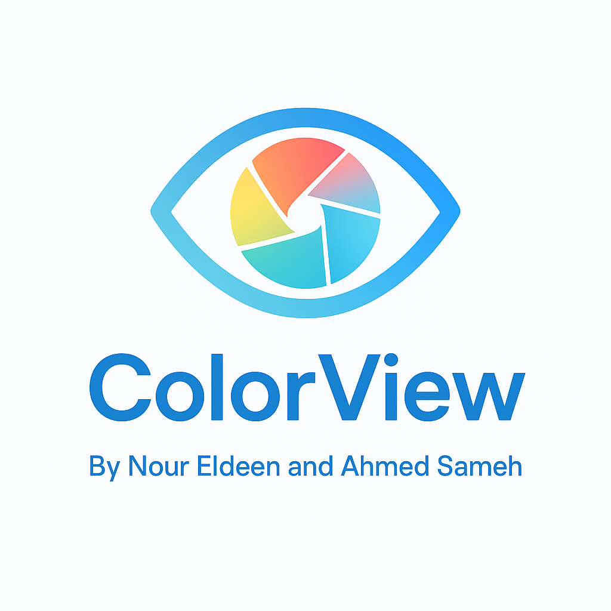
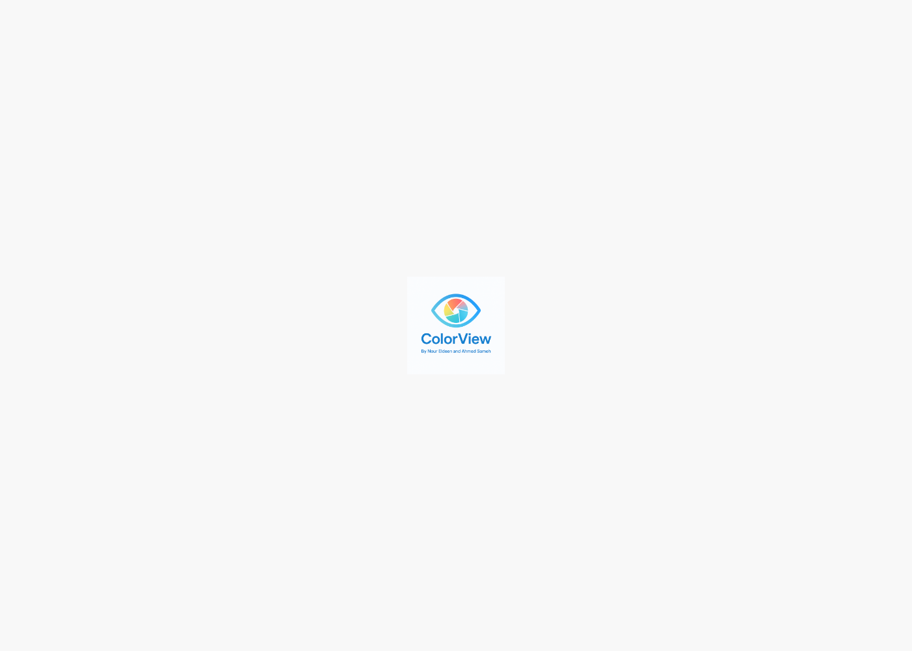
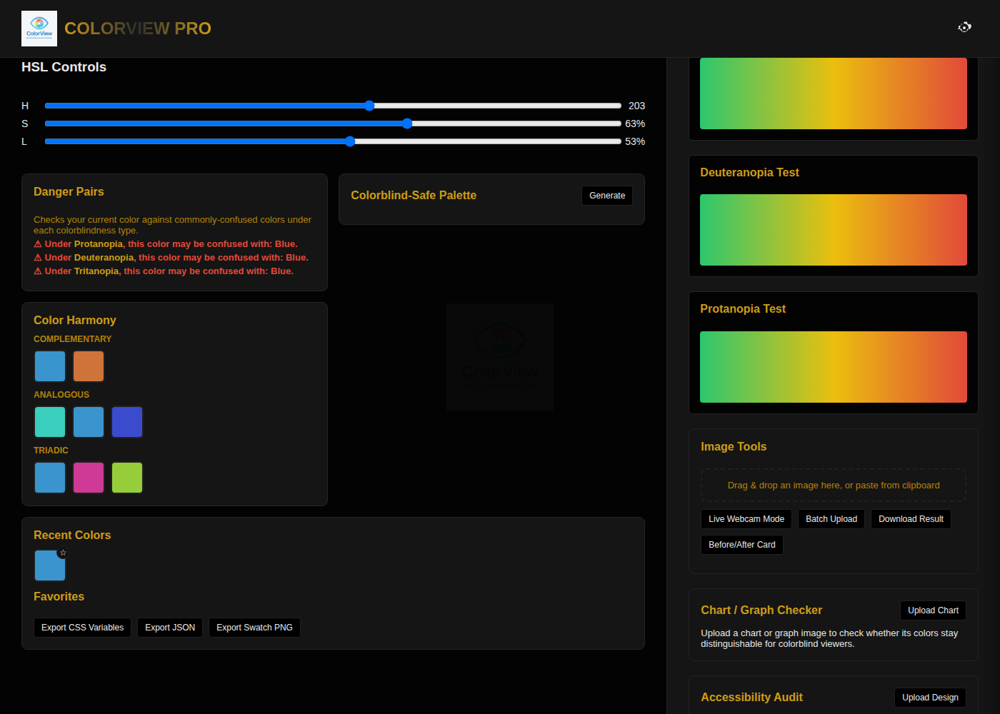

<div align="center">



# ColorView Pro

**A free, accessible color tool for colorblind users and the designers building for them.**

[](https://colorview-pro.github.io/colorview/)


[**🔗 Use ColorView Pro**](https://colorview-pro.github.io/colorview/)

</div>

---

## What is ColorView Pro?

ColorView Pro is a color picker and image-simulation tool built to help colorblind people, and the people designing for them, understand how colors actually look under 8 different types of color blindness. Pick a color, upload a design, or turn on your webcam — and see it the way millions of colorblind users do, then fix it before it ships.

It's a single-page, no-build, installable web app — open `index.html` and it just works, offline included.

## Screenshots

<p align="center">
  
  
</p>

## Features

**🎨 Color Picker & Values**
- HEX / RGB / HSL input, live-linked HSL sliders, and a screen eyedropper
- Search for a color by name, or see the closest name to whatever you picked
- Recent colors and favorites, with export to CSS variables, JSON, or a swatch PNG

**👁️ Color Blindness Simulation**
- 8 simulation modes: Protanopia, Protanomaly, Deuteranopia, Deuteranomaly, Tritanopia, Tritanomaly, Achromatopsia, and Achromatomaly
- Adjustable severity slider, plus a "preview the whole site" toggle so you can browse the entire tool the way a colorblind user would
- A built-in Ishihara-style self-test to help you figure out which mode matches your own vision

**🖼️ Image Tools**
- Drag, drop, or paste an image (or use live webcam mode) to see an Original / Simulated / Corrected (daltonized) side-by-side
- Batch-upload multiple images at once
- Download the result or generate a shareable before/after card

**🛡️ Design Safety Checks**
- **Danger Pairs** — flags colors your current pick is commonly confused with, per colorblindness type
- **Colorblind-Safe Palette** generator
- **Color Harmony** — complementary, analogous, and triadic suggestions
- **Chart/Graph Checker** — upload a chart and check whether its colors stay distinguishable
- **Accessibility Audit** — checks a design's dominant colors for WCAG text contrast and colorblind safety

**⚙️ Personalization & Accessibility**
- Light, dark, and custom-accent themes
- 7 languages: English, العربية, Español, Русский, Français, Deutsch, Português
- Adjustable font size, dyslexia-friendly font, and reduced-motion mode
- PC and mobile layout switch
- Save "my condition" once and the right simulation mode auto-selects every time

**📱 Installable & Offline**
- Ships as a PWA with a service worker — install it to your home screen and it keeps working with no connection

## Getting Started

No build tools, no dependencies, no install step.

```bash
git clone https://github.com/colorview-pro/colorview.git
cd colorview
```

Then just open `index.html` in your browser — or serve it locally so the service worker behaves like it will in production:

```bash
python3 -m http.server 8000
# then visit http://localhost:8000
```

## Project Structure

```
colorview/
├── index.html      # App markup
├── style.css       # All styling (light/dark themes, layout, components)
├── script.js       # Color math, simulation filters, UI logic
├── manifest.json   # PWA manifest
├── sw.js           # Service worker (offline app-shell caching)
├── logo.png        # Light logo
└── logo-dark.png   # Dark-mode logo
```

## Tech Stack

Plain HTML, CSS, and JavaScript — no frameworks, no build step. Color blindness simulation and daltonization run entirely client-side.

## About

Hi 👋 We're Nour Eldeen and Ahmed Sameh — two students who wanted to build something that actually helps people. ColorView Pro started as a way to make color blindness simulation and design accessibility checks available to anyone, for free, right in the browser. We used AI tools to help us learn and move faster while building it.

More updates are on the way — feedback and issues are always welcome.

— **Nour Eldeen & Ahmed Sameh**

## License

MIT
